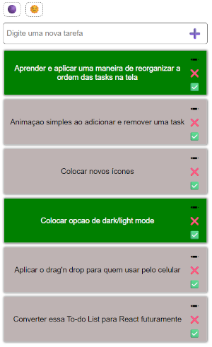
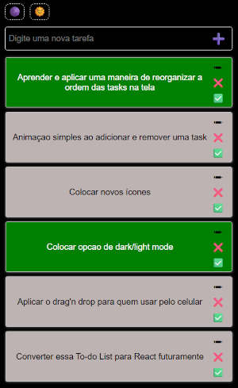

# To-Do List - Projeto JavaScript

Este é um projeto de lista de tarefas interativa, desenvolvido com **HTML, CSS e JavaScript puro**, com foco em funcionalidades práticas e organização de código. Foi criado como parte da minha jornada de aprendizado rumo a uma vaga de desenvolvedor júnior.

## Preview

## Funcionalidades

- Adicionar tarefas
- Editar tarefas existentes
- Marcar tarefas como concluídas
- Deletar tarefas
- Reordenar com drag and drop
- Salva no localStorage
- Modo claro e escuro

## Conceitos Praticados

- Manipulação de DOM com JavaScript
- Estruturação dinâmica de elementos HTML
- Eventos (`click`, `dragstart`, `drop`, etc.)
- Condicionais e funções reutilizáveis
- `localStorage` para persistência de dados
- Organização de código em módulos JS (`import/export`)
- Princípios como **DRY (Don't Repeat Yourself)**

## Aprendizado

Esse projeto me ensinou sobre como estruturar e organizar código JavaScript. Além disso, me ajudou a entender como manipular elementos do DOM com eficiência e salvar dados localmente sem usar backend.

## Próximos Passos

Tornar responsivo para mobile

Adicionar animações

Implementar suporte a drag & drop no celular

Converter para React futuramente

## Feito por LuisFPamplona

